# 🎓 College ERP System (Django)

A simple College ERP system built using Django.  
This project includes separate panels for Admin, Teacher, and Student with features like assignment management, grading, and attendance handling.

---

## 🚀 Features

### 👨‍🏫 Teacher Panel
- Add Subjects
- Add Assignments
- View Assignments
- View Student Submissions
- Grade Submissions
- Take Attendance
- View Attendance (Subject-wise)

### 👩‍🎓 Student Panel
- View Subjects
- View Assignments
- Submit Assignments
- View Grades

### 🛠 Admin Panel
- Manage Teachers
- Manage Students
- Manage Subjects
- Django Admin Integration

---

## 🏗 Technologies Used

- Python 3.x
- Django 5.x
- HTML
- CSS
- SQLite (Default Django Database)

---
## ⚙️ Installation & Setup


```bash
1.git clone https://github.com/your-username/your-repository-name.git
2.cd ERP
3.pip install django
4.python manage.py makemigrations
5.python manage.py migrate
6.python manage.py createsuperuser
7.python manage.py runserver
---

## 📊 Database Models (Core)
1.User (Django default)
2.Teacher
3.Student
4.Subject
5.Assignment
6.Submission
7.Attendance

## Screenshots
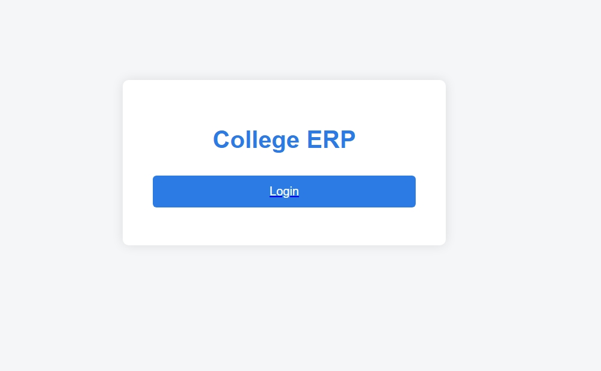 
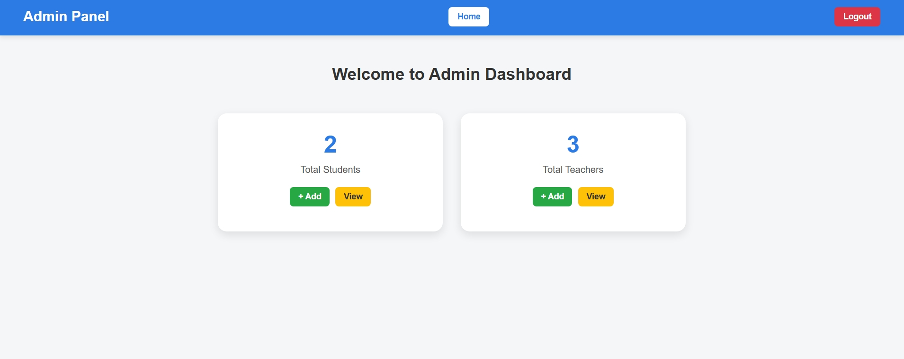  
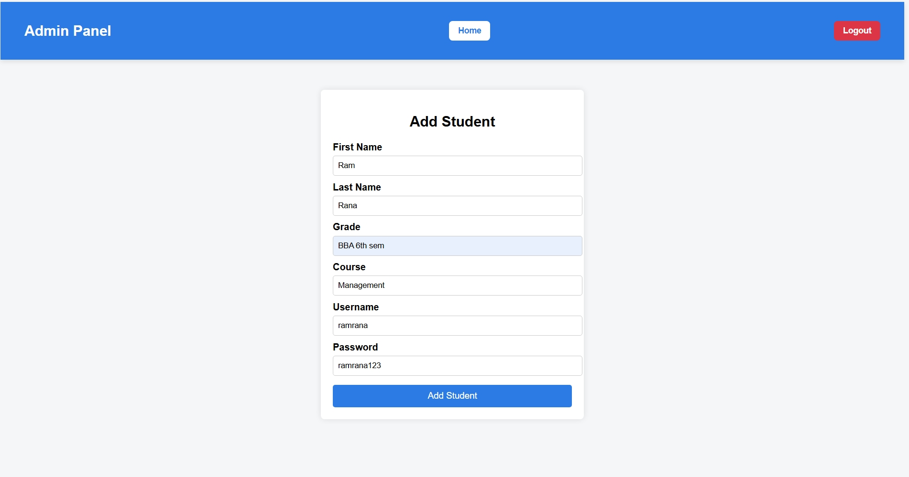
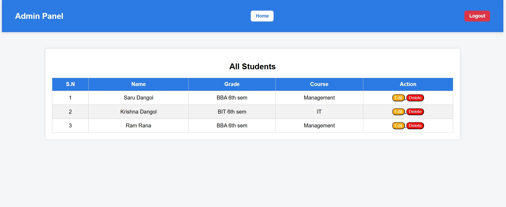
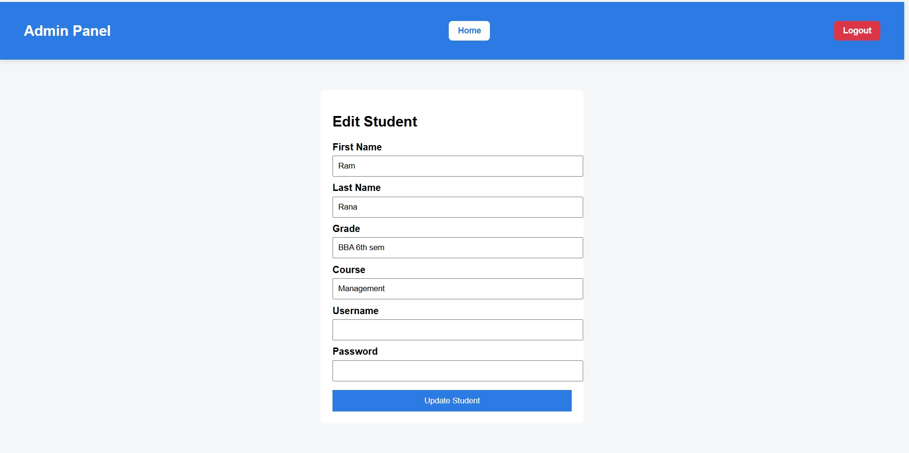  
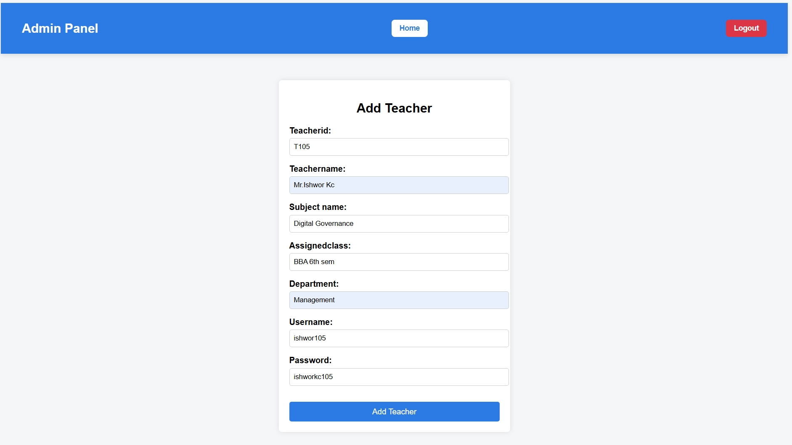
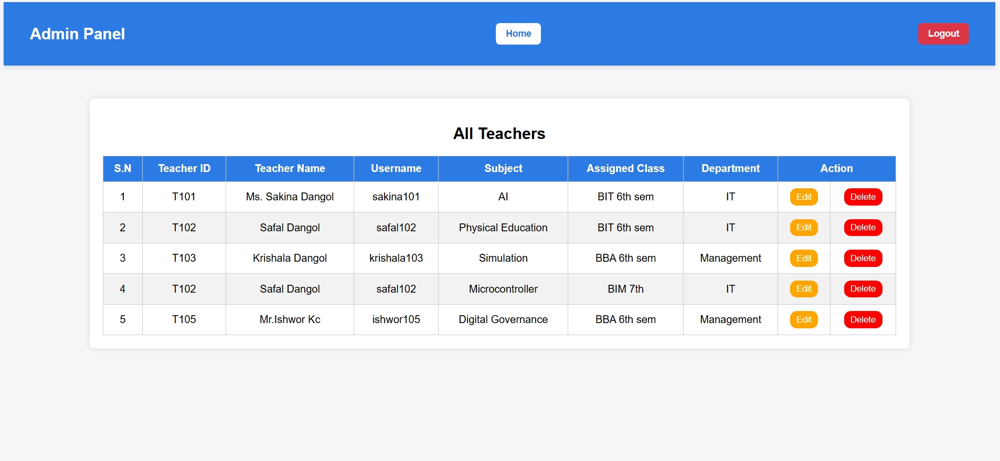
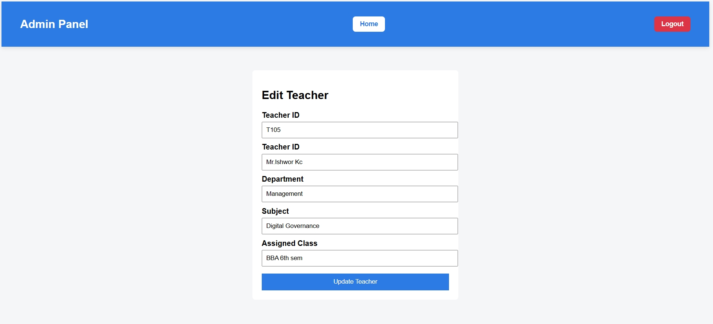  
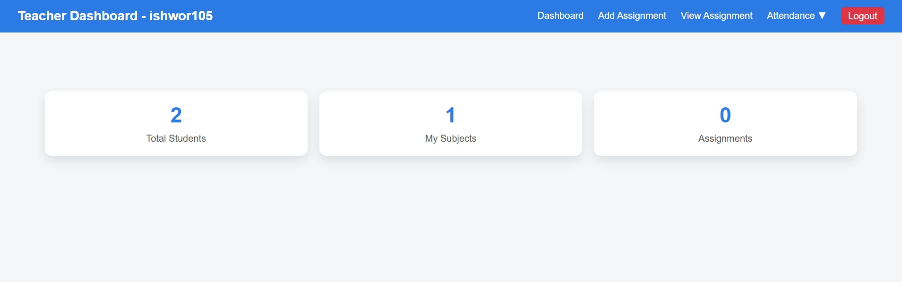
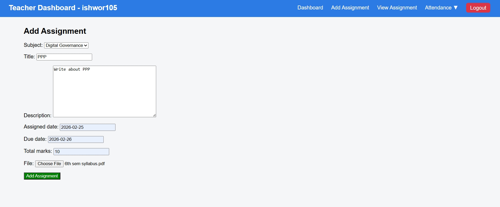  
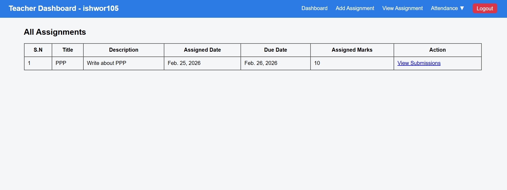  
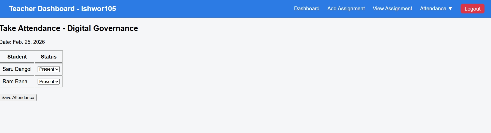  
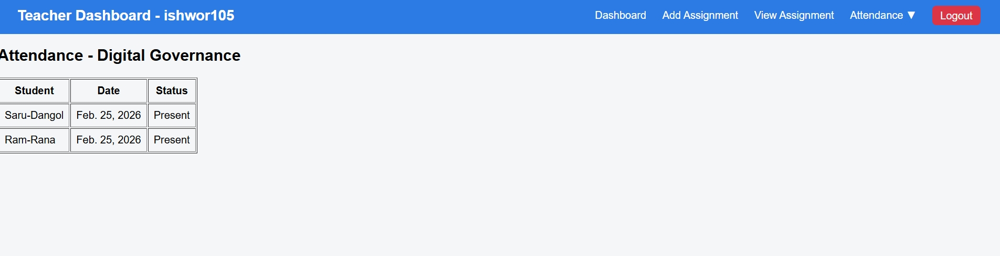  
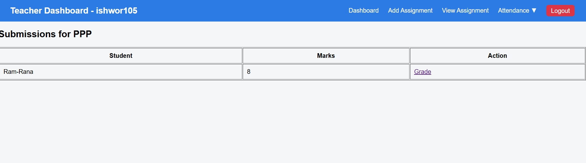  
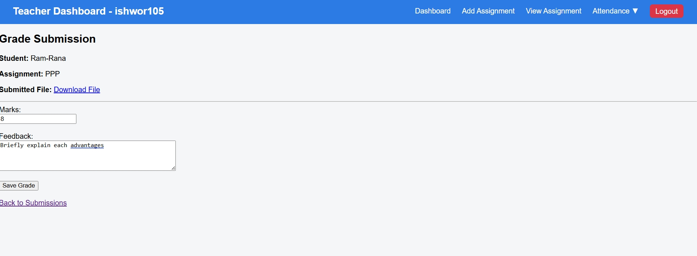  
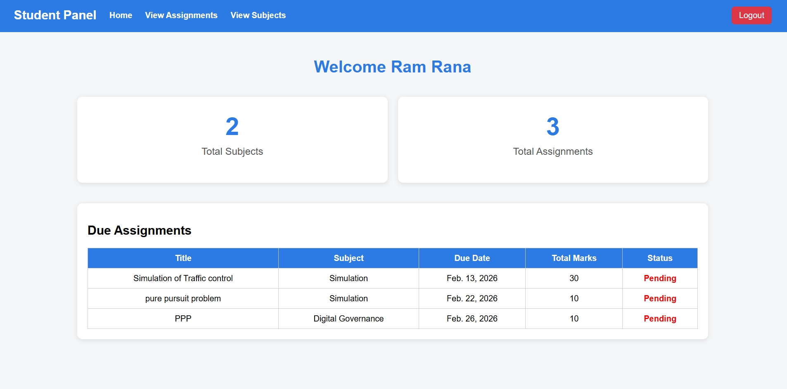  
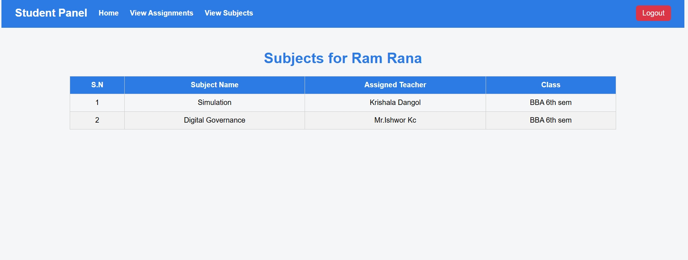  
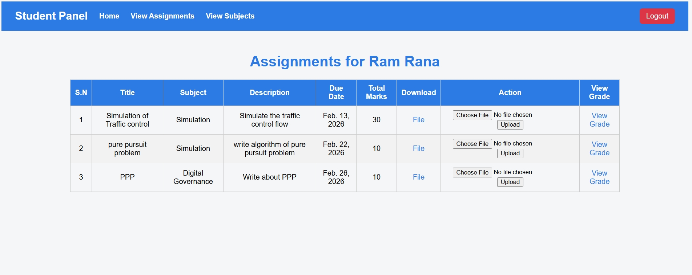  
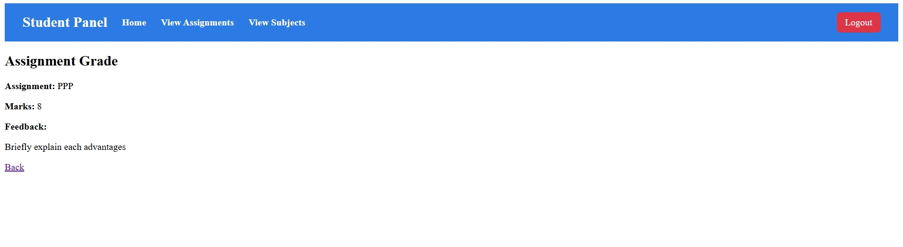  


